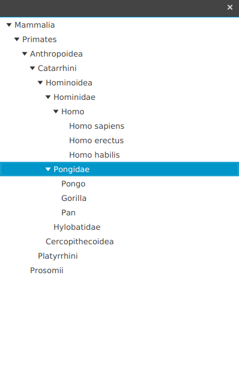

# treeviewhierarchy
A JavaFX TreeView with a list of items. Original version by Christian Schudt http://myjavafx.blogspot.com/2012/03/treeview-with-data-source.html

## Download
```xml
<dependency>
  <groupId>com.sirolf2009</groupId>
	<artifactId>treeviewhierarchy</artifactId>
	<version>0.0.1</version>
</dependency>
```

## Basic Usage
```java
public class TreeViewHierarchyExample extends Application {

	@Override
	public void start(Stage primaryStage) throws Exception {
		final TreeViewHierarchy<AnimalType> treeView = new TreeViewHierarchy<>(new TreeItem<>());
		treeView.setItems(FXCollections.observableArrayList(buildMammalia()));
		treeView.setShowRoot(false);
		final Scene scene = new Scene(treeView, 400, 600);
		primaryStage.setScene(scene);
		primaryStage.show();
	}

	public static AnimalType buildMammalia() {
		final AnimalType homoSapiens = new AnimalType("Homo sapiens", FXCollections.emptyObservableList());
		final AnimalType homoErectus = new AnimalType("Homo erectus", FXCollections.emptyObservableList());
		final AnimalType homoHabilis = new AnimalType("Homo habilis", FXCollections.emptyObservableList());
		final AnimalType homo = new AnimalType("Homo", FXCollections.observableArrayList(homoSapiens, homoErectus, homoHabilis));
		final AnimalType hominidae = new AnimalType("Hominidae", FXCollections.observableArrayList(homo));

		final AnimalType pongo = new AnimalType("Pongo", FXCollections.emptyObservableList());
		final AnimalType gorilla = new AnimalType("Gorilla", FXCollections.emptyObservableList());
		final AnimalType pan = new AnimalType("Pan", FXCollections.emptyObservableList());
		final AnimalType pongidae = new AnimalType("Pongidae", FXCollections.observableArrayList(pongo, gorilla, pan));

		final AnimalType hylobatidae = new AnimalType("Hylobatidae", FXCollections.emptyObservableList());
		final AnimalType hominoidea = new AnimalType("Hominoidea", FXCollections.observableArrayList(hominidae, pongidae, hylobatidae));

		final AnimalType cercopithecoidea = new AnimalType("Cercopithecoidea", FXCollections.emptyObservableList());
		final AnimalType catarrhini = new AnimalType("Catarrhini", FXCollections.observableArrayList(hominoidea, cercopithecoidea));

		final AnimalType platyrrhini = new AnimalType("Platyrrhini", FXCollections.emptyObservableList());
		final AnimalType anthropoidea = new AnimalType("Anthropoidea", FXCollections.observableArrayList(catarrhini, platyrrhini));

		final AnimalType prosimii = new AnimalType("Prosomii", FXCollections.emptyObservableList());
		final AnimalType primates = new AnimalType("Primates", FXCollections.observableArrayList(anthropoidea, prosimii));
		return new AnimalType("Mammalia", FXCollections.observableArrayList(primates));
	}

	public static void main(String[] args) {
		launch(args);
	}

	public static class AnimalType implements IHierarchicalData<AnimalType> {

		private final String name;
		private final ObservableList<AnimalType> children;

		public AnimalType(String name, ObservableList<AnimalType> children) {
			this.name = name;
			this.children = children;
		}

		@Override
		public String toString() {
			return name;
		}

		@Override
		public ObservableList<AnimalType> getChildren() {
			return children;
		}

	}

}
```

## Screenshot

